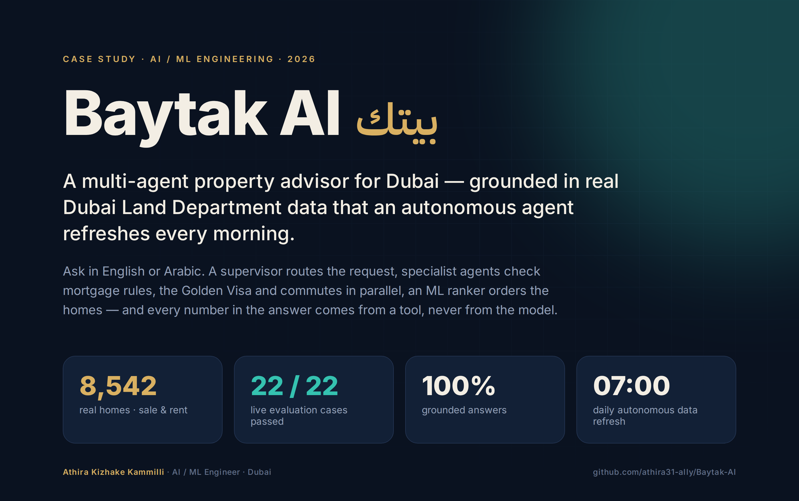
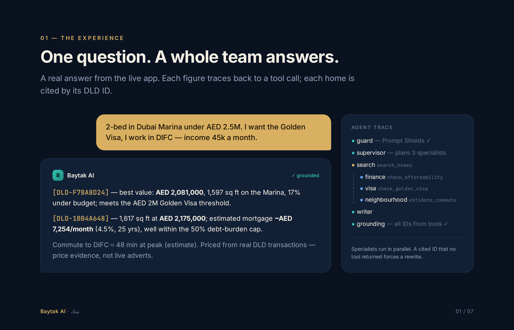
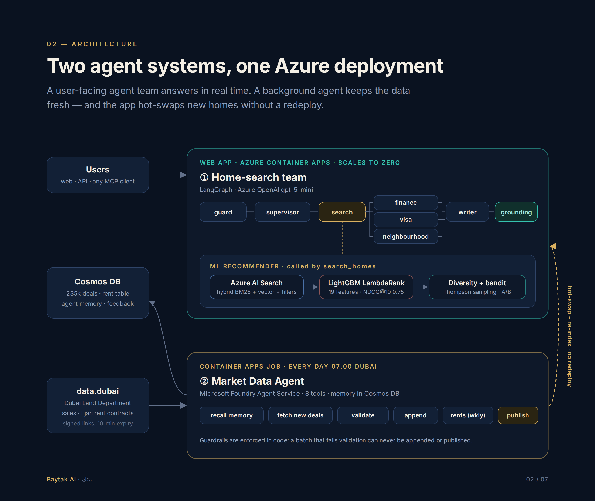
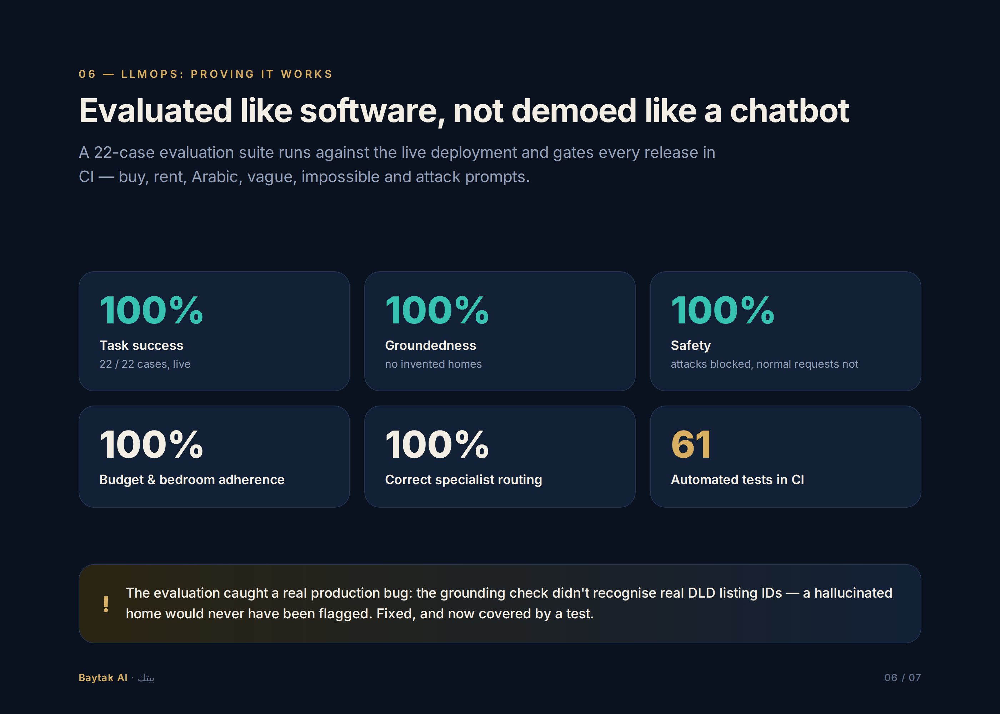
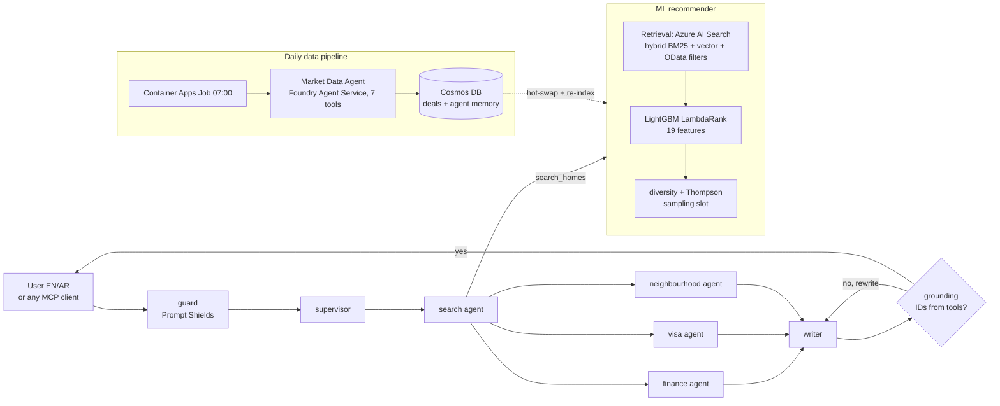
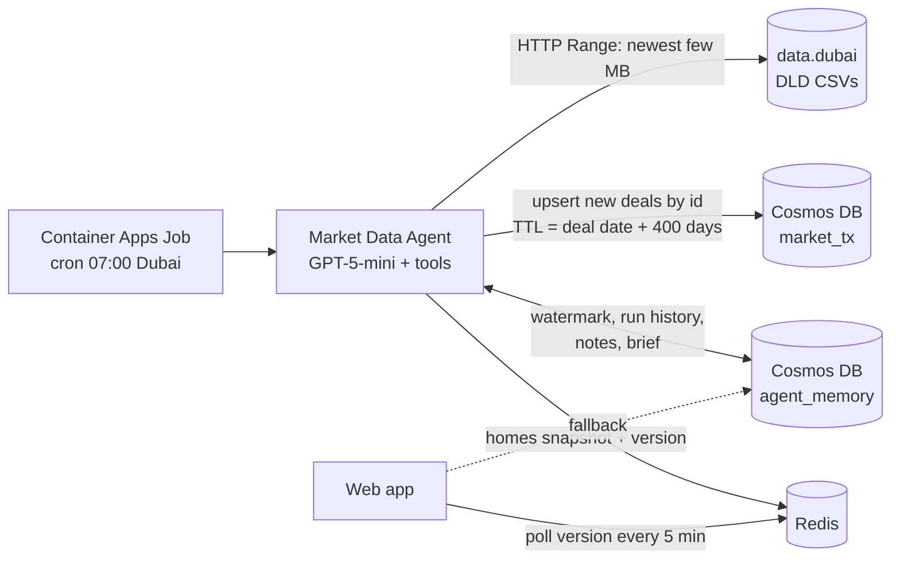

# Baytak AI · بيتك

<p align="center">
  
</p>

<p align="center">
  <a href="https://athira31-ally.github.io/Baytak-AI/"><b>🌐 Portfolio case study</b></a> &nbsp;·&nbsp;
  <a href="https://baytak-ai.victoriousriver-467d20dd.uaenorth.azurecontainerapps.io"><b>🚀 Live app</b></a> &nbsp;·&nbsp;
  <a href="https://www.linkedin.com/in/athira-kizhake-kammilli-150116198"><b>LinkedIn</b></a>
</p>

<p align="center">
  
  
  
  
  
  
</p>

**A multi-agent property advisor for Dubai, grounded in real Dubai Land Department data that an autonomous agent
refreshes every morning.** *Baytak* is Arabic for "your home".

Ask in English or Arabic, e.g. *"2-bed in Dubai Marina under AED 2.5M, I want the Golden Visa, I work in DIFC"*.
A supervisor agent routes the request; search, finance, visa and neighbourhood agents work in parallel over an
ML recommender and UAE-specific tools; a writer answers — and a grounding check guarantees every home it cites
came from a tool.

| | |
|---|---|
| **8,542** real homes (sale + rent) | from 235k DLD sales and 12 months of Ejari rent contracts |
| **22 / 22** live evaluation cases | 100% task success, groundedness, constraint adherence, routing and safety |
| **NDCG@10 0.75** vs 0.31 baseline | LightGBM LambdaRank on 19 features (simulated users) |
| **07:00 daily** | Market Data Agent on Microsoft Foundry appends new deals; rents refresh weekly |

<p align="center"></p>

### Architecture

<p align="center"></p>

### Evaluated like software

<p align="center"></p>

> More visuals (agent team, recommender, data pipeline, stack) are in the
> [portfolio case study](https://athira31-ally.github.io/Baytak-AI/).

---

Aligned with the **Dubai Universal Blueprint for AI**, the **D33 Economic Agenda** and the
**UAE National AI Strategy 2031**, which push AI agents into real services such as real estate, one of
Dubai's biggest sectors.

Two agent systems share one Azure deployment:

1. **Home-search team (user-facing)** - a **LangGraph** multi-agent graph. A supervisor reads the request and routes
   it; a search agent drives the ML recommender; finance, visa and neighbourhood specialists run **in parallel**;
   a writer composes the answer; a grounding check forces a rewrite if any listing ID didn't come from a tool.
2. **Market Data Agent (daily, 07:00 Dubai)** - runs on **Microsoft Foundry Agent Service**. It appends only the
   new Dubai Land Department deals to Cosmos DB, validates them, rebuilds the homes and republishes them;
   the web app hot-swaps them in and re-indexes **Azure AI Search**, with no redeploy.



| Capability | Technology | Where |
|---|---|---|
| Multi-agent orchestration | LangGraph (supervisor, parallel fan-out with `Send`, conditional retry loop) | `app/agents/graph.py` |
| Managed agent | Microsoft Foundry Agent Service (versioned agent, conversations, function tools) | `app/data/foundry_agent.py` |
| Tool protocol | MCP server (streamable HTTP at `/mcp/`, stdio) - usable from Claude, Copilot, Cursor | `app/mcp_server.py` |
| Retrieval | Azure AI Search hybrid + filters, versioned zero-downtime index, local fallback | `app/recsys/search_index.py`, `retrieval.py` |
| Open-source / on-prem LLM | Any OpenAI-compatible server (Ollama, vLLM, NIM), e.g. Qwen 2.5 - `docker compose up` | `app/agents/llm.py`, `docker-compose.yml` |
| Evaluation (LLMOps) | 22-case eval set: task success, groundedness, constraint adherence, routing, tool use, safety, latency; LLM-as-judge; CI gate | `app/evals.py`, `scripts/run_evals.py` |
| Safety | Azure AI Content Safety Prompt Shields + local injection checks; grounding check | `app/safety.py` |
| Observability | OpenTelemetry spans per agent and tool, exported to Application Insights | `app/observability.py` |

## Results (offline, held-out simulated users)

| Model | NDCG@10 | Precision@10 (saved+) | Hit-rate@10 (contacted agent) |
|---|---|---|---|
| **LightGBM LambdaRank** | **0.75** | **0.45** | **0.72** |
| Retrieval score only (baseline) | 0.31 | 0.17 | 0.32 |
| Random | 0.26 | 0.14 | 0.34 |

Regenerated on every `python -m scripts.bootstrap` → `artifacts/metrics.json`, also served at `/metrics/offline`.

> **What's real and what's simulated:** the *homes and prices are real* (Dubai Land Department sales and
> Ejari rent contracts), but *user behaviour is simulated*: users with hidden preferences (commute sensitivity,
> school weight, price sensitivity) generate the clicks the ranker learns from. The pipeline, evaluation method
> and serving stack are real.

## What's inside

| Area | What it shows | Where |
|---|---|---|
| Classic agent (AGENT_ENGINE=classic) | Single Azure OpenAI tool-calling loop, max-steps guard, offline fallback | `app/agents/orchestrator.py` |
| Guardrails | Grounding check flags any listing ID the LLM didn't get from a tool | `orchestrator.py`, `tests/test_agent_loop.py` |
| Retrieval | Hard filters + semantic vectors, progressive relaxation; Azure AI Search hybrid variant | `app/recsys/retrieval.py` |
| Ranking | 19 features (commute, schools, budget fit, deal score, Golden Visa match...), LambdaRank | `app/recsys/features.py`, `ranker.py` |
| Cold start | Thompson sampling over communities for fresh listings (one reserved slot) | `app/recsys/bandit.py` |
| Experimentation | Sticky hash bucketing (80/20), Bayesian A/B read-out: P(ranker better), lift CI | `app/recsys/pipeline.py` |
| UAE domain | LTV tiers, 50% debt-burden ratio cap, 4% DLD fee, Golden Visa, annual rents, Arabic | `app/agents/tools.py`, `parser.py` |
| MLOps | Docker, Azure Container Apps (UAE North), Cosmos DB, App Insights, CI | `Dockerfile`, `infra/deploy.sh` |

## Evaluate the agents

```bash
python -m scripts.run_evals --offline          # deterministic agents (what CI gates on)
python -m scripts.run_evals --judge            # with your LLM + LLM-as-judge scores
python -m scripts.run_evals --url https://<app> --no-gate      # the deployed app
python -m scripts.run_evals --engine classic   # compare with the single-loop agent
```

## Run it on an open-source model (on-prem)

```bash
docker compose up -d        # Ollama + Qwen 2.5 3B + Baytak AI, nothing leaves the machine
# or point at any OpenAI-compatible server:
LLM_PROVIDER=openai_compatible LLM_BASE_URL=http://localhost:11434/v1 LLM_MODEL=qwen2.5:7b-instruct \
  python -m uvicorn app.main:app
```

## Use it from any MCP client

Claude Desktop / Claude Code / VS Code (Copilot agent mode) / Cursor - add a server:

```json
{"mcpServers": {"baytak": {"type": "http", "url": "https://<your-app>/mcp/"}}}
```

or run it locally over stdio: `python -m app.mcp_server`.

## Run it locally (5 minutes, no Azure needed)

```bash
python -m venv .venv && source .venv/bin/activate
pip install -r requirements-dev.txt
python -m scripts.bootstrap      # listings, embeddings, simulated sessions, ranker, eval (~40s)
python -m pytest -q              # 18 tests
uvicorn app.main:app --reload    # open http://localhost:8000  (API docs at /docs)
```

With no `.env`, the agent runs in **offline mode**: a rule-based parser (English and basic Arabic) replaces
the LLM and everything else is identical. Useful for development and as a baseline to compare the LLM against.

## Switch on Azure, one service at a time

Copy `.env.example` to `.env`, then:

1. **Azure OpenAI (the agent).** Create a resource and deploy a current chat model such as `gpt-4.1-mini` (whichever your
   region offers). Set `AZURE_OPENAI_ENDPOINT`, `AZURE_OPENAI_API_KEY`, `AZURE_OPENAI_CHAT_DEPLOYMENT`.
   `/health` now shows `"llm": "azure-openai"`.
2. **Cosmos DB (feedback).** Serverless account, then set `COSMOS_ENDPOINT`, `COSMOS_KEY`. The database and container are created automatically.
3. **Application Insights.** Set `APPLICATIONINSIGHTS_CONNECTION_STRING`. Each chat logs mode, tools used, grounding and latency.
4. **Switching retrieval to Azure AI Search.**
   - Deploy `text-embedding-3-small` in Azure OpenAI and set `EMBEDDING_PROVIDER=azure`.
   - `python -m scripts.bootstrap` (re-embeds with Azure; the simulation makes ~2.5k embedding calls, a few minutes)
   - Create a Search service (try the Free tier first), set `AZURE_SEARCH_ENDPOINT` + `AZURE_SEARCH_API_KEY`
   - `python -m scripts.index_azure_search`
   - When deploying, build with `--build-arg BOOTSTRAP=0` so the image uses your Azure-embedded artifacts.

### One-command deploy

```bash
az login
bash infra/deploy.sh          # Azure OpenAI + Cosmos (serverless) + App Insights + Container Apps in UAE North
```

The app scales to zero, so the running cost at portfolio traffic is small. The main cost is Azure AI Search
if you use a paid tier. **Check current Azure pricing, and run `az group delete -n rg-dubai-home-match` when
you're done demoing.**

## Use real Dubai data

Baytak AI can run on **real Dubai Land Department (DLD) records** instead of synthetic listings, either
**live** (recommended) or from downloaded files.

### Daily: the Market Data Agent (recommended)

A cron-scheduled **LLM agent** appends each day's new DLD deals instead of reloading the history.



| Tool | What it does |
|---|---|
| `recall_memory` | watermark (newest deal stored), store size, typical daily volume, recent runs, notes |
| `fetch_new_deals` | only deals since watermark - 3 days. Reads data.dubai files with **HTTP Range** from the newest end (a few MB, not 1.1 GB); uses the Dubai Pulse API date filter when keys are set |
| `validate_batch` | schema, no future dates, batch size, volume vs. history, prices vs. stored medians |
| `append_deals` | upsert into Cosmos by transaction id, advance the watermark. **Refused in code unless validation passed** |
| `rebuild_homes` | medians over the rolling 12 months in Cosmos, publish to Cosmos + Redis |
| `remember` | a note for future runs (e.g. why a batch was rejected) |
| `market_brief` | numbers for the daily report, served at `/market-brief` |

Old deals expire by themselves (per-item TTL), re-sent deals just overwrite (idempotent), and the web app
hot-swaps new homes within minutes: no rebuild, no redeploy. Deploy with `bash infra/deploy_data_agent.sh`
(add `ENABLE_REDIS=1` for Redis). Run locally with `python -m scripts.data_agent --files data/raw/*.csv`.

**Runs on Microsoft Foundry Agent Service.** With `FOUNDRY_PROJECT_ENDPOINT` set (`bash infra/deploy_foundry.sh`),
the Market Data Agent is a versioned **Foundry agent** (`baytak-market-data-agent`: gpt-5-mini, instructions,
7 function tools). Each daily run is a Foundry conversation you can open in the portal. The tools are
client-executed: Foundry decides which tool to call, the job runs it against Cosmos/Redis/DLD and returns
the result (`app/data/foundry_agent.py`). A new agent version is created only when the prompt or tools change.

### Live: Dubai Pulse API (refreshes itself daily)

1. Register at [dubaipulse.gov.ae](https://www.dubaipulse.gov.ae) and request access to
   `dld_transactions-open-api` (and `dld_rent_contracts-open-api`). The API key and secret arrive by email.
2. Put them in `.env` as `DUBAI_PULSE_API_KEY` / `DUBAI_PULSE_API_SECRET`, then run
   `python -m scripts.check_dubai_pulse`. It checks the token, the API URLs, date filtering and the columns.
3. Deploy with the keys set: `DUBAI_PULSE_API_KEY=... DUBAI_PULSE_API_SECRET=... bash infra/deploy.sh`
   (plus your usual variables). They're stored as Container App secrets.

The app then fetches the last 12 months in the background at startup and every 24 hours, rebuilds the homes
and swaps them in without a restart (`app/data/live.py`). It keeps serving the previous data while refreshing
or if the API is down. `/health` shows the data source, the latest deal date and the refresh status.

### From downloaded files

1. Go to the [DLD open data portal](https://dubailand.gov.ae/en/open-data/real-estate-data/) → **Transactions**,
   set the last 12 months, and click **Download as CSV** (there's a CAPTCHA, so this step is manual).
   Optionally do the same under **Rents** for rental homes. Older years are on
   [Dubai Pulse](https://www.dubaipulse.gov.ae/data/dld-transactions/dld_transactions-open).
2. Save the files as `data/raw/transactions.csv` (and `data/raw/rents.csv`). `data/raw/` is git-ignored.
3. Build the homes file:
   ```bash
   python -m scripts.load_dld_real --sales data/raw/transactions.csv --rents data/raw/rents.csv
   python -m scripts.bootstrap          # now uses data/real/dld_homes.csv automatically
   ```
4. Commit `data/real/` (small, aggregated). The Docker build picks it up, so the live app runs on real data.

**What a "home" means with real data.** DLD publishes registered deals, not live adverts. Each recommendable
item is a real building + unit type (e.g. a 2-bed flat in a named Marina tower), priced at the **median of its
real registered sales or Ejari rents**, with the deal count shown. That's reliable evidence of what such a home
costs. Live adverts come from portals (Bayut, Property Finder), which don't offer a public API, so the View panel
links out to search for current listings in that building. User behaviour for training the ranker is still simulated.

The loader prints which DLD areas it couldn't map to the 21 supported communities, so you can extend
`DLD_AREA_HINTS` in `scripts/load_dld_real.py`.

## API

| Method | Path | Purpose |
|---|---|---|
| POST | `/chat` | Agent: `{"message": "...", "monthly_income_aed": 45000}` → answer, recs, tool trace, grounded flag |
| POST | `/recommend` | Direct structured search with a `UserQuery` body |
| POST | `/feedback` | `impression / click / save / dismiss / contact` events |
| GET | `/metrics/offline` · `/metrics/ab` · `/metrics/bandit` | Offline eval, live Bayesian A/B, bandit posteriors |
| GET | `/health` · `/docs` | Which backends are active; OpenAPI UI |
