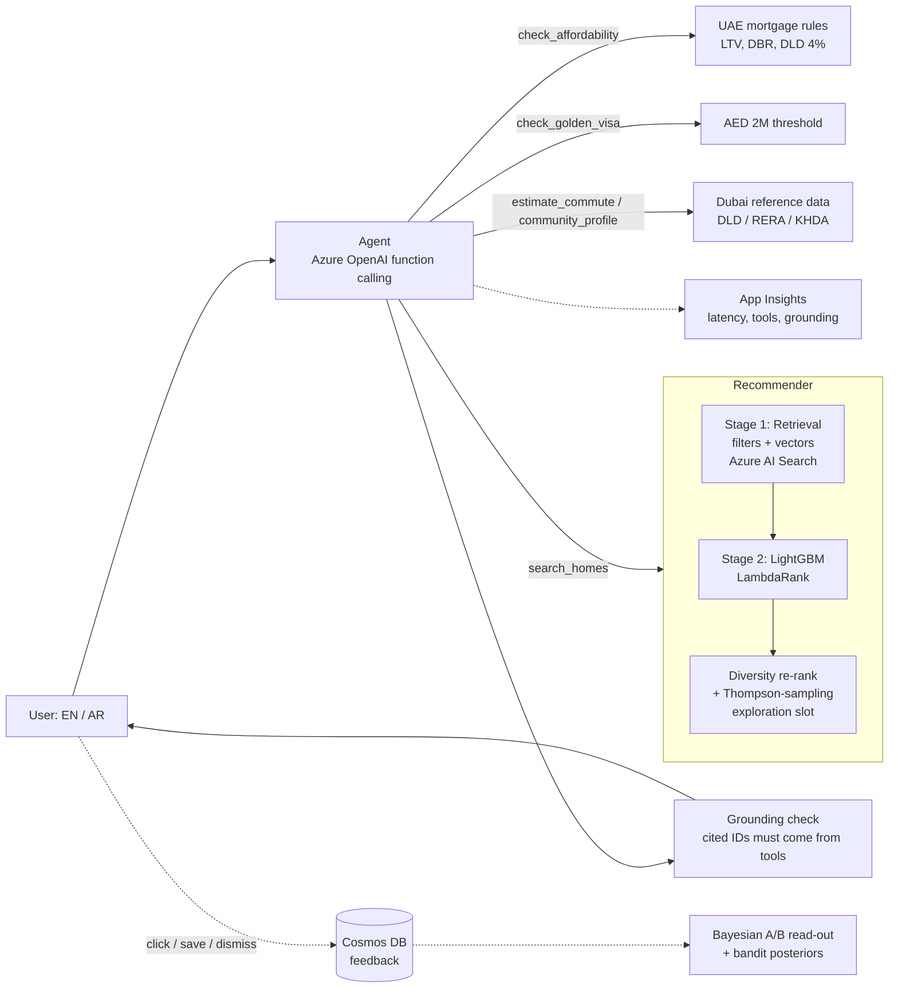

# Baytak AI · بيتك

**An agentic AI property recommender for Dubai, built on Azure.** *Baytak* is Arabic for "your home".

A user asks, in English or Arabic, something like *"Family of 4, budget AED 2.2M, I work in DIFC, want good
schools and Golden Visa eligibility"*. An AI agent works out what they need and calls tools to search, rank,
check commute times, mortgage affordability under UAE rules, and Golden Visa eligibility. It then replies with
a shortlist, every pick explained and every listing ID checked against the tool results.

Aligned with the **Dubai Universal Blueprint for AI**, the **D33 Economic Agenda** and the
**UAE National AI Strategy 2031**, which push AI agents into real services such as real estate, one of
Dubai's biggest sectors.



## Results (offline, held-out simulated users)

| Model | NDCG@10 | Precision@10 (saved+) | Hit-rate@10 (contacted agent) |
|---|---|---|---|
| **LightGBM LambdaRank** | **0.75** | **0.45** | **0.72** |
| Retrieval score only (baseline) | 0.31 | 0.17 | 0.32 |
| Random | 0.26 | 0.14 | 0.34 |

Regenerated on every `python -m scripts.bootstrap` → `artifacts/metrics.json`, also served at `/metrics/offline`.

> **Be upfront about this in interviews:** listings and user behaviour are *simulated*. Users have hidden
> preferences (commute sensitivity, school weight, price sensitivity) that generate clicks, and the ranker
> has to learn them from observable features. The pipeline, evaluation method and serving stack are real.
> The community price data can be switched to real DLD transactions (see below).

## What's inside

| Area | What it shows | Where |
|---|---|---|
| Agentic AI | Azure OpenAI tool-calling loop, max-steps guard, graceful offline fallback | `app/agents/orchestrator.py` |
| Guardrails | Grounding check flags any listing ID the LLM didn't get from a tool | `orchestrator.py`, `tests/test_agent_loop.py` |
| Retrieval | Hard filters + semantic vectors, progressive relaxation; Azure AI Search hybrid variant | `app/recsys/retrieval.py` |
| Ranking | 19 features (commute, schools, budget fit, deal score, Golden Visa match...), LambdaRank | `app/recsys/features.py`, `ranker.py` |
| Cold start | Thompson sampling over communities for fresh listings (one reserved slot) | `app/recsys/bandit.py` |
| Experimentation | Sticky hash bucketing (80/20), Bayesian A/B read-out: P(ranker better), lift CI | `app/recsys/pipeline.py` |
| UAE domain | LTV tiers, 50% debt-burden ratio cap, 4% DLD fee, Golden Visa, annual rents, Arabic | `app/agents/tools.py`, `parser.py` |
| MLOps | Docker, Azure Container Apps (UAE North), Cosmos DB, App Insights, CI | `Dockerfile`, `infra/deploy.sh` |

## Run it locally (5 minutes, no Azure needed)

```bash
python -m venv .venv && source .venv/bin/activate
pip install -r requirements-dev.txt
python -m scripts.bootstrap      # listings, embeddings, simulated sessions, ranker, eval (~40s)
python -m pytest -q              # 18 tests
uvicorn app.main:app --reload    # open http://localhost:8000  (API docs at /docs)
```

With no `.env`, the agent runs in **offline mode**: a rule-based parser (English and basic Arabic) replaces
the LLM and everything else is identical. Useful for development and as a baseline to compare the LLM against.

## Switch on Azure, one service at a time

Copy `.env.example` to `.env`, then:

1. **Azure OpenAI (the agent).** Create a resource and deploy a current chat model such as `gpt-4.1-mini` (whichever your
   region offers). Set `AZURE_OPENAI_ENDPOINT`, `AZURE_OPENAI_API_KEY`, `AZURE_OPENAI_CHAT_DEPLOYMENT`.
   `/health` now shows `"llm": "azure-openai"`.
2. **Cosmos DB (feedback).** Serverless account, then set `COSMOS_ENDPOINT`, `COSMOS_KEY`. The database and container are created automatically.
3. **Application Insights.** Set `APPLICATIONINSIGHTS_CONNECTION_STRING`. Each chat logs mode, tools used, grounding and latency.
4. **Switching retrieval to Azure AI Search.**
   - Deploy `text-embedding-3-small` in Azure OpenAI and set `EMBEDDING_PROVIDER=azure`.
   - `python -m scripts.bootstrap` (re-embeds with Azure; the simulation makes ~2.5k embedding calls, a few minutes)
   - Create a Search service (try the Free tier first), set `AZURE_SEARCH_ENDPOINT` + `AZURE_SEARCH_API_KEY`
   - `python -m scripts.index_azure_search`
   - When deploying, build with `--build-arg BOOTSTRAP=0` so the image uses your Azure-embedded artifacts.

### One-command deploy

```bash
az login
bash infra/deploy.sh          # Azure OpenAI + Cosmos (serverless) + App Insights + Container Apps in UAE North
```

The app scales to zero, so the running cost at portfolio traffic is small. The main cost is Azure AI Search
if you use a paid tier. **Check current Azure pricing, and run `az group delete -n rg-dubai-home-match` when
you're done demoing.**

## Use real Dubai data

```bash
# Download the DLD Transactions CSV from Dubai Pulse / DLD open data, then:
python -m scripts.load_dld_transactions path/to/transactions.csv
python -m scripts.bootstrap
```

This computes real 12-month median AED/sq ft per community and overrides the illustrative seed values. Verify the
DLD area → community mapping in the script (DLD uses official names, e.g. *Marsa Dubai* = Dubai Marina).

## API

| Method | Path | Purpose |
|---|---|---|
| POST | `/chat` | Agent: `{"message": "...", "monthly_income_aed": 45000}` → answer, recs, tool trace, grounded flag |
| POST | `/recommend` | Direct structured search with a `UserQuery` body |
| POST | `/feedback` | `impression / click / save / dismiss / contact` events |
| GET | `/metrics/offline` · `/metrics/ab` · `/metrics/bandit` | Offline eval, live Bayesian A/B, bandit posteriors |
| GET | `/health` · `/docs` | Which backends are active; OpenAPI UI |

## 4-week plan (starting 23 Sep 2026)

**Week 1: run and understand it.** Run locally, read every file, and break things on purpose. Push to GitHub with CI green.
Record a 2-minute Loom of the UI and the agent trace.

**Week 2: go live on Azure.** Deploy with `infra/deploy.sh`, switch on Azure OpenAI, Cosmos and App Insights. Put the live URL
in your resume and LinkedIn. Build an App Insights workbook: p95 latency, tool-call mix, % grounded.

**Week 3: real data and evaluation.** Load DLD transactions. Write 30 test prompts (EN + AR) with expected
`UserQuery` fields and measure LLM extraction accuracy against the rule-based parser. Add an LLM-as-judge
faithfulness score for the answers.

**Week 4: depth for interviews** (pick 2):
- Azure Maps Route API for real commute times
- Azure AI Search + `text-embedding-3-small` hybrid retrieval, with recall@200 compared to local
- CUPED variance reduction in `ab_summary` (use pre-period CTR as the covariate)
- Multi-agent split with Semantic Kernel / Azure AI Foundry Agent Service (planner + finance agent + critic)
- Rent-vs-buy calculator tool; RERA rental-increase calculator for tenants

## Interview talking points

- *Why two stages?* Retrieval is cheap and recall-oriented; the ranker is expensive and precision-oriented. The LLM never ranks, it orchestrates.
- *How do you stop hallucinated listings?* Tools own the facts; a grounding check rejects IDs that no tool returned (there's a test for it).
- *Cold start?* New listings get a reserved exploration slot chosen by Thompson sampling, so they collect feedback without hurting the page much.
- *How would you ship the ranker?* Sticky 80/20 split, Bayesian read-out, ship when P(better) > 95% with a lift CI above 0.
- *UAE specifics:* annual rents, 4% DLD fee, LTV tiers by residency/price/off-plan, 50% DBR cap, AED 2M Golden Visa threshold, Arabic queries, UAE North hosting for data residency.

*Finance and visa figures are simplified estimates. Verify against current UAE Central Bank, DLD and GDRFA rules.*
